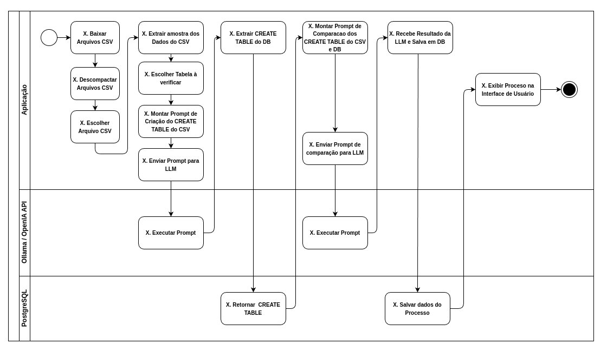
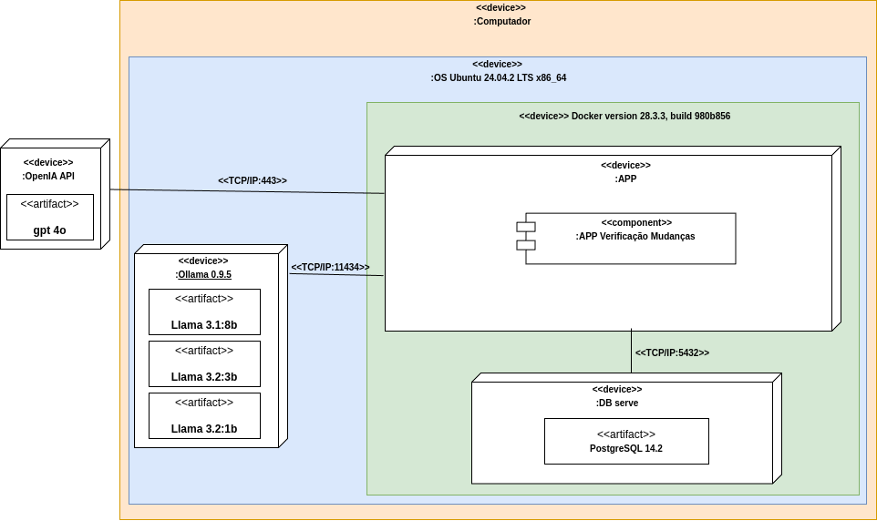

# DISSERTAÇÃO DE MESTRADO (Rafael Freitas Lima)
Código da solução desenvolvida para a dissertação de Mestrado Profissional no Cesar School.


                                ATIVIDADES DO PROJETO

### Aplicação

* [X] Download automático do arquivo ZIP contendo os arquivos CSV
* [X] Extração dos arquivos arquivos CSV do arquivo ZIP
* [X] Criar o LLM MANAGER para facilitar a interação com as LLM
* [X] Criar script para a montagem do PROMPT para traduzir o arquivo CSV em um DDL de criação de uma tabela para o PostgreSQL
* [X] Recuperar o nome das colunas do CSV;
   * [X] Recuperar 4 primeiras linhas do CSV;
   * [X] Mecanismo de inclusão do nome da tabela do banco de dados;
* [X] Criar Script para extrair o DDL da tabela do banco de dados.
* [X] Criar script para a montagem do PROMPT para comparar os DDLs do CSV como o do Banco de dados e verificar mudanças.
* [X] Criar Script para salvar os resultados das verificações no banco de dados.
   * [X] Criar Model para salvar os resultados da execução.
* [ _ ] Criar uma interface Web para uso da aplicação.
    * [ _ ] Atualizar base de CSV;
    * [ _ ] Executar comparação;
    * [ _ ] Exibir resultados da comparação.
* [X] Criar um Script para calcular o tamanho da amostra de execuções dos LLMs.
* [X] Criar um Script para executar cada um dos quatros Modelos LLM.
   * [X] Llama3.1:8b
   * [X] Llama3.2:3b
   * [X] Llama3.2:1b
   * [X] gpt-4o


### Análise e Validação da aplicação

* [X] Código para análise:
    * [X] Model de ORM de análise (TbAvaliacaoModel);
    * [X] Repository TbAvaliacaoRepository;
    * [X] Service avaliacao_services.py
* [X] Criar cenário de experimento controlado:
   * [X] Criar Tabela e CSV sem diferenças.
   * [X] CSV com diferenças.
   * [X] Tabela com DDL para testes. (AJUSTAR A TABELA DO BANCO DE DADOS)
      * Nome diferente da coluna csv ="situacao_contratacao TEXT  NULL";  Tabela = "situ_contratacao varchar NULL".
      * Sem a coluna "nr_processo text NULL,"
    * [X] Listar diferenção que devem se alvo do experimento.
* [x] Rodar o script 385 vezes para cada Modelo LLM.
   * [x] Llama3.1:8b
   * [x] Llama3.2:3b
   * [X] Llama3.2:1b
   * [X] gpt-4o
* [ _ ] Criar um Script analisar os dados.
   * [x] Model de ORM das métricas da análise;
   * [x] Repository TbMetricasRepository;
   * [X] Levantar tamanho da amostra por Modelo de LLM ( Cada um Tamanho da Amostra:385)
   * [x] Métrica 1: Criou o DDl de Create Table a partir do CSV com todas as colunas?
   * [x] Métrica 2: Ao criar o DDL a partir do CSV faltou colunas?
   * [x] Métrica 3: Ao criar o DDL a partir do CSV adicionou colunas extras?
   * [x] Métrica 4: Achou o nome diferente situacao_contratacao TEXT  NULL";  Tabela = "situ_contratacao varchar NULL"?
   * [x] Métrica 5: Achou inclusão da coluna "nr_processo"?
   * [ _ ] Métrica 6: SQL resolve o problema?


</br>

---

</br>
</br>

**Documentação do Sistema:**








</br>

</br>


**Documentação do OLLAMA:** https://github.com/ollama/ollama

---


**AMBIENTE DE DESENVOLVIMENTO DO SISTEMA**

| Componente          | Especificação                      |
|---------------------|------------------------------------|
| Processador         | Ryzen 7 8700g w/ Radeon 780        |
| Memória             | 2x 16GB (32GB) DDR5 6000MHz        |
| Placa Mãe           | Placa Mãe MSI PRO B650M-P          |
| Armazenamento       | SD Sandisk Plus 500GB SATA III 2,5 |
| Sistema Operacional | Ubuntu 24.04.2 LTS x86_64          |
| Linguagem Versão    | Python 3.10.12                     |
| Editor de Código    | Visual Studio Code 1.98.2          |

<br>

---

<br>

**Modelos Usados**

| Model              | Parameters | Size  | Download                         |
| ------------------ | ---------- | ----- | -------------------------------- |
| Llama 3.2:3b       | 3B         | 2.0GB | `ollama run llama3.2:3b`         |
| Llama 3.2:1b       | 1B         | 1.3GB | `ollama run llama3.2:1b`         |
| Llama 3.1:8b       | 8B         | 4.7GB | `ollama run llama3.1:8b`         |

Fonte *https://github.com/ollama/ollama*

---

<br>

**Libs Python Usados**

| Lib                | Versão | Uso                                                |
| ------------------ | ------ |-------                                             |
| python-dotenv      | 1.1.0  | Uso de variáveis de ambiente                       |
| Flask              | 3.1.0  | Framework web                                      |
| psycopg-binary     | 3.2.1  | Conexão com banco PostgreSQL                       |
| psycopg            | 3.2.1  | Conexão com banco PostgreSQL                       |
| SQLAlchemy         | 2.0.31 | Kit de ferramenta SQL para python                  |
| pandas             | 2.2.2  | É uma ferramenta de análise e manipulação de dados |
| requests           | 2.32.3 | Requisição Http para Baixar arquivos               |
| ollama             | 0.4.7  | Fornece integração com o Ollama                    |
| langchain          | 0.3.23 |  |
| langchain-ollama   | 0.3.1  |  |
| langchain-community | 0.3.21 |  |
| openai             | 1.95.1 |  |


---

<br>

**MANUAL DE INSTALAÇÂO**

**Passo 1:** 

* Instalar a lib python venv

```
sudo apt install python3.10-venv
```

<br>

* Criar a venv 

```
python3 -m venv venv
```

<br>

* Ativar a venv

```
source venv/bin/activate
```

<br>

**Passo 2:**

* Instalar as Libs Python

```
pip install -r requirements.txt
```

<br>


**USA DA API DO OLLAMA**

Documentação: 

* https://github.com/ollama/ollama-python

* https://python.langchain.com/docs/integrations/providers/ollama/#llm

* https://python.langchain.com/docs/integrations/llms/ollama/

**Passo 1:** 

